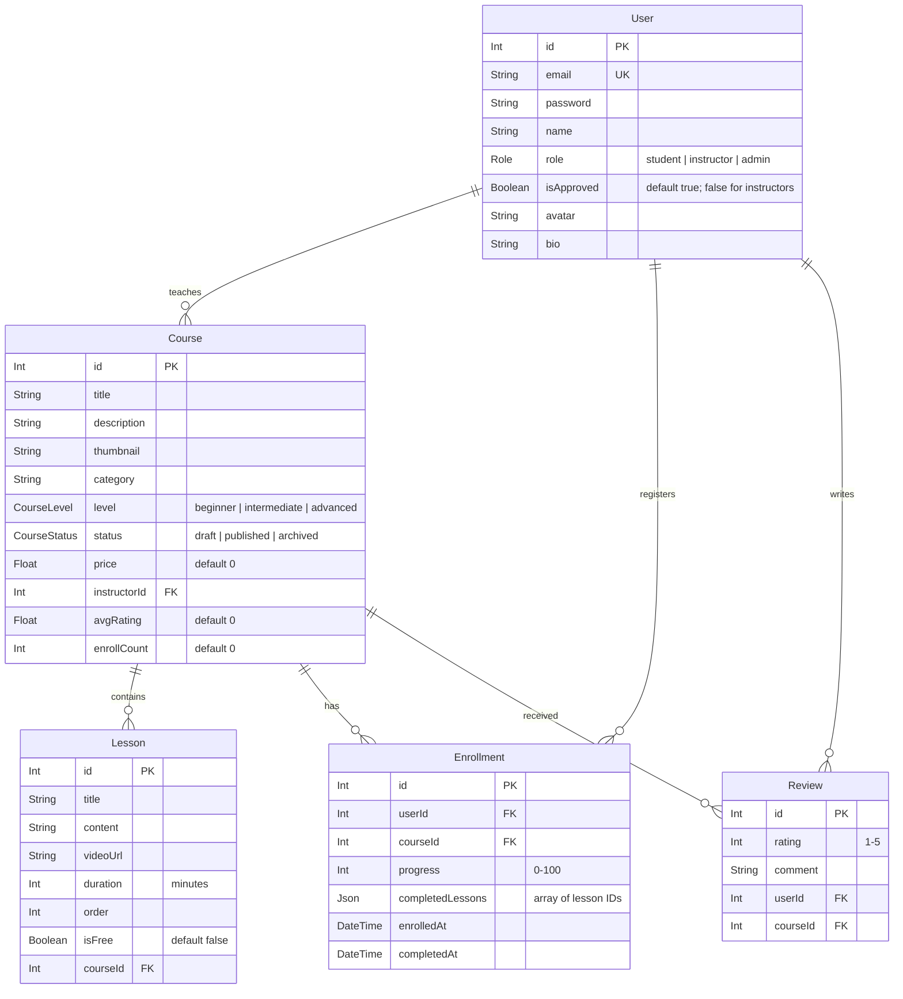

# Architecture

## Stack

| Layer            | Tool                      | Purpose                                       |
| ---------------- | ------------------------- | --------------------------------------------- |
| Frontend         | Angular 21                | Client UI application                         |
| Backend          | NestJS 11 (Express)       | REST API backend service                      |
| Database         | PostgreSQL (Supabase)     | Primary relational storage                    |
| ORM              | Prisma Client             | Database queries and schemas                  |
| Styling          | Tailwind CSS + shadcn/ui  | Design tokens and theme components            |
| Auth             | Passport JWT              | Session validation and access guards          |
| Language         | TypeScript (Strict)       | System-wide type safety                       |

---

## Folder Structure

```
learn-nest/
├── backend/                                    # 📂 NestJS Application
│   ├── prisma/
│   │   ├── schema.prisma                       #    Prisma database schema models
│   │   └── seed.ts                             #    Mock data seeds for development
│   ├── src/
│   │   ├── main.ts                             #    App bootstrap, Swagger, global validation
│   │   ├── app.module.ts                       #    Root NestJS module imports
│   │   ├── lib/
│   │   │   └── database/                       #    Global PrismaModule and PrismaService
│   │   ├── common/                             #    Shared filters, guards, pipes, interceptors
│   │   │   ├── guards/                         #    JwtAuthGuard, RolesGuard, OptionalJwtAuthGuard
│   │   │   ├── decorators/                     #    CurrentUser, Roles metadata binder
│   │   │   └── types/                          #    SafeUser type and sanitizeUser utility
│   │   └── auth/, users/, courses/, ...        #    Feature modules (controller, service, dtos)
│   └── test/                                   #    Jest integration and e2e test suites
│
├── frontend/                                   # 📂 Angular Application
│   ├── src/
│   │   ├── index.html                          #    Main template HTML
│   │   ├── main.ts                             #    Application entry point
│   │   ├── styles.css                          #    Global styling + Tailwind directives
│   │   ├── app/
│   │   │   ├── app.config.ts                   #    Routing config, HTTP interceptors, providers
│   │   │   ├── app.routes.ts                   #    Angular route paths configuration
│   │   │   ├── core/                           #    Global services, auth state, HTTP interceptor
│   │   │   │   ├── services/                   #    AuthService, ApiService
│   │   │   │   └── guards/                     #    AuthGuard, RoleGuard
│   │   │   ├── layout/                         #    Base layouts (NavbarComponent, FooterComponent)
│   │   │   ├── shared/                         #    Re-usable UI components (buttons, badges)
│   │   │   └── features/                       #    Domain feature modules
│   │   │       ├── home/, auth/, dashboard/    #    Pages components
│   │   │       └── courses/, classroom/        #    Course details and player components
│   │   └── environments/                       #    Base variables (development vs production)
```

---

## Database Schema (Prisma)

The application has five core relational tables managed by Prisma:



---

## Authentication & Authorization Architecture

1. **Stateful JWT Auth**:
   - The user registers or logs in via the `auth` controller.
   - The backend validates credentials and signs a JWT containing the user `id`, `email`, and `role`.
   - The frontend stores this JWT in localStorage or cookies, attaching it as an `Authorization: Bearer <token>` header to outgoing API requests via an Angular HTTP Interceptor.

2. **Access Guards**:
   - **`JwtAuthGuard`**: Restricts route access to verified logged-in users.
   - **`OptionalJwtAuthGuard`**: Allows public requests to proceed, but parses the JWT user context if available (used for lessons retrieval to permit public previews of free lessons while guarding paid lessons for non-enrolled users).
   - **`RolesGuard`**: Restricts endpoints to specific account roles (e.g. `@Roles(Role.ADMIN)` for pending instructor approval).
