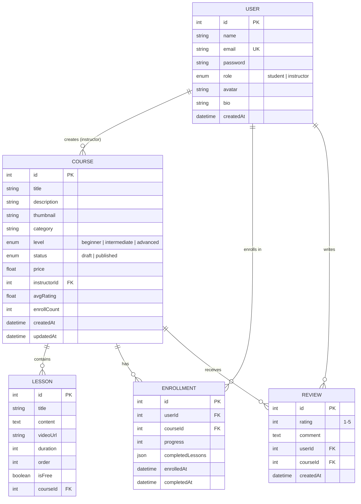

# 📁 Online Learning Platform — Full File Structure

## Backend (NestJS)

```
backend/
├── uploads/                                    # 📂 File storage (git-ignored)
│   ├── avatars/                                #    User profile pictures
│   ├── thumbnails/                             #    Course thumbnail images
│   └── videos/                                 #    Lesson video files
│
├── src/
│   ├── main.ts                                 # 🚀 App bootstrap, Swagger, CORS, global pipes
│   ├── app.module.ts                           # 📦 Root module — imports all feature modules
│   │
│   ├── config/
│   │   └── database.config.ts                  # ⚙️ TypeORM + SQLite connection config
│   │
│   ├── common/                                 # 🔧 Shared utilities across all modules
│   │   ├── decorators/
│   │   │   ├── current-user.decorator.ts       #    @CurrentUser() — extracts user from JWT
│   │   │   └── roles.decorator.ts              #    @Roles() — sets required roles metadata
│   │   ├── guards/
│   │   │   ├── jwt-auth.guard.ts               #    Protects routes — requires valid JWT
│   │   │   └── roles.guard.ts                  #    Checks user role matches @Roles()
│   │   ├── pipes/
│   │   │   └── parse-int.pipe.ts               #    Converts string params to integers
│   │   ├── filters/
│   │   │   └── http-exception.filter.ts        #    Global error response formatting
│   │   ├── interceptors/
│   │   │   └── transform.interceptor.ts        #    Wraps responses in { data, message }
│   │   └── enums/
│   │       ├── role.enum.ts                    #    Role.STUDENT | Role.INSTRUCTOR
│   │       ├── course-level.enum.ts            #    BEGINNER | INTERMEDIATE | ADVANCED
│   │       └── course-status.enum.ts           #    DRAFT | PUBLISHED | ARCHIVED
│   │
│   ├── auth/                                   # 🔐 Authentication module
│   │   ├── auth.module.ts                      #    Module — imports JwtModule, PassportModule
│   │   ├── auth.controller.ts                  #    POST /register, POST /login, GET /me
│   │   ├── auth.service.ts                     #    Hash passwords, validate, issue JWT
│   │   ├── strategies/
│   │   │   └── jwt.strategy.ts                 #    Passport JWT strategy — validates token
│   │   └── dto/
│   │       ├── register.dto.ts                 #    { name, email, password, role }
│   │       └── login.dto.ts                    #    { email, password }
│   │
│   ├── users/                                  # 👤 User management module
│   │   ├── users.module.ts                     #    Module — exports UsersService
│   │   ├── users.controller.ts                 #    GET /profile, PUT /profile, PUT /avatar
│   │   ├── users.service.ts                    #    findByEmail, findById, update, uploadAvatar
│   │   ├── entities/
│   │   │   └── user.entity.ts                  #    id, name, email, password, role, avatar, bio
│   │   └── dto/
│   │       └── update-user.dto.ts              #    { name?, bio?, avatar? }
│   │
│   ├── courses/                                # 📚 Course management module
│   │   ├── courses.module.ts                   #    Module — imports LessonsModule
│   │   ├── courses.controller.ts               #    CRUD + browse/search/filter
│   │   ├── courses.service.ts                  #    Create, update, delete, findAll, findOne
│   │   ├── entities/
│   │   │   └── course.entity.ts                #    id, title, description, thumbnail, category,
│   │   │                                       #    level, price, status, instructor(→User),
│   │   │                                       #    lessons(→Lesson[]), avgRating, enrollCount
│   │   └── dto/
│   │       ├── create-course.dto.ts            #    { title, description, category, level, price }
│   │       ├── update-course.dto.ts            #    PartialType of create
│   │       └── query-course.dto.ts             #    { search?, category?, level?, sort?, page?, limit? }
│   │
│   ├── lessons/                                # 🎬 Lesson & video module
│   │   ├── lessons.module.ts                   #    Module
│   │   ├── lessons.controller.ts               #    CRUD + video upload endpoint
│   │   ├── lessons.service.ts                  #    Create, update, delete, reorder
│   │   ├── entities/
│   │   │   └── lesson.entity.ts                #    id, title, content, videoUrl, duration,
│   │   │                                       #    order, isFree, course(→Course)
│   │   └── dto/
│   │       ├── create-lesson.dto.ts            #    { title, content, order, isFree }
│   │       └── update-lesson.dto.ts            #    PartialType of create
│   │
│   ├── enrollments/                            # 📋 Enrollment & progress module
│   │   ├── enrollments.module.ts               #    Module
│   │   ├── enrollments.controller.ts           #    POST /enroll, GET /my-courses, PUT /progress
│   │   ├── enrollments.service.ts              #    Enroll, track progress, mark complete
│   │   ├── entities/
│   │   │   └── enrollment.entity.ts            #    id, user(→User), course(→Course), progress(%),
│   │   │                                       #    completedLessons(JSON), enrolledAt, completedAt
│   │   └── dto/
│   │       └── update-progress.dto.ts          #    { lessonId, completed }
│   │
│   ├── reviews/                                # ⭐ Course review & rating module
│   │   ├── reviews.module.ts                   #    Module
│   │   ├── reviews.controller.ts               #    POST /review, GET /reviews, PUT, DELETE
│   │   ├── reviews.service.ts                  #    Create, update, delete, getAverageRating
│   │   ├── entities/
│   │   │   └── review.entity.ts                #    id, rating(1-5), comment, user(→User),
│   │   │                                       #    course(→Course), createdAt
│   │   └── dto/
│   │       └── create-review.dto.ts            #    { rating, comment }
│   │
│   └── dashboard/                              # 📊 Analytics & stats module
│       ├── dashboard.module.ts                 #    Module
│       ├── dashboard.controller.ts             #    GET /instructor-stats, GET /student-stats
│       └── dashboard.service.ts                #    Aggregate queries for charts & stats
│
├── test/
│   ├── app.e2e-spec.ts                         # 🧪 End-to-end tests
│   └── jest-e2e.json
│
├── package.json
├── nest-cli.json
├── tsconfig.json
├── tsconfig.build.json
└── .env                                        # ⚙️ JWT_SECRET, DB_PATH, UPLOAD_PATH
```

---

## Frontend (Angular)

```
frontend/
├── public/
│   └── favicon.ico
│
├── src/
│   ├── index.html                              # 📄 Root HTML — Google Fonts, meta tags
│   ├── main.ts                                 # 🚀 Angular bootstrap
│   ├── styles.css                              # 🎨 Global styles, Material theme, CSS variables
│   │
│   ├── environments/
│   │   ├── environment.ts                      # ⚙️ Dev config — apiUrl: localhost:3000
│   │   └── environment.prod.ts                 # ⚙️ Prod config — apiUrl: production URL
│   │
│   ├── app/
│   │   ├── app.component.ts                    # 🏠 Root component — layout shell
│   │   ├── app.component.html                  #    <header> + <router-outlet> + <footer>
│   │   ├── app.component.css                   #    Root layout styles
│   │   ├── app.config.ts                       # ⚙️ Providers — HttpClient, Router, Animations
│   │   ├── app.routes.ts                       # 🗺️ Route definitions with lazy loading
│   │   │
│   │   ├── core/                               # 🔧 Singleton services & app-wide utilities
│   │   │   ├── services/
│   │   │   │   ├── auth.service.ts             #    login(), register(), logout(), currentUser$
│   │   │   │   ├── course.service.ts           #    getCourses(), getCourse(), createCourse()...
│   │   │   │   ├── lesson.service.ts           #    getLessons(), createLesson(), uploadVideo()
│   │   │   │   ├── enrollment.service.ts       #    enroll(), getMyCourses(), updateProgress()
│   │   │   │   ├── review.service.ts           #    getReviews(), createReview()
│   │   │   │   ├── dashboard.service.ts        #    getInstructorStats(), getStudentStats()
│   │   │   │   └── notification.service.ts     #    showSuccess(), showError() — toast messages
│   │   │   │
│   │   │   ├── interceptors/
│   │   │   │   ├── auth.interceptor.ts         #    Attaches JWT token to every HTTP request
│   │   │   │   └── error.interceptor.ts        #    Global HTTP error handling & toast
│   │   │   │
│   │   │   ├── guards/
│   │   │   │   ├── auth.guard.ts               #    Redirect to /login if not authenticated
│   │   │   │   └── role.guard.ts               #    Redirect if user role doesn't match route
│   │   │   │
│   │   │   └── models/
│   │   │       ├── user.model.ts               #    User interface
│   │   │       ├── course.model.ts             #    Course interface
│   │   │       ├── lesson.model.ts             #    Lesson interface
│   │   │       ├── enrollment.model.ts         #    Enrollment interface
│   │   │       ├── review.model.ts             #    Review interface
│   │   │       └── api-response.model.ts       #    Generic API response wrapper
│   │   │
│   │   ├── shared/                             # ♻️ Reusable components & pipes
│   │   │   ├── components/
│   │   │   │   ├── star-rating/
│   │   │   │   │   ├── star-rating.component.ts
│   │   │   │   │   ├── star-rating.component.html
│   │   │   │   │   └── star-rating.component.css
│   │   │   │   ├── stats-card/
│   │   │   │   │   ├── stats-card.component.ts     #    Icon + Label + Value card
│   │   │   │   │   ├── stats-card.component.html
│   │   │   │   │   └── stats-card.component.css
│   │   │   │   ├── course-card/
│   │   │   │   │   ├── course-card.component.ts    #    Course preview card (thumbnail, title...)
│   │   │   │   │   ├── course-card.component.html
│   │   │   │   │   └── course-card.component.css
│   │   │   │   ├── progress-bar/
│   │   │   │   │   ├── progress-bar.component.ts   #    Custom progress bar with %
│   │   │   │   │   ├── progress-bar.component.html
│   │   │   │   │   └── progress-bar.component.css
│   │   │   │   ├── empty-state/
│   │   │   │   │   ├── empty-state.component.ts    #    "No results" placeholder
│   │   │   │   │   ├── empty-state.component.html
│   │   │   │   │   └── empty-state.component.css
│   │   │   │   └── confirm-dialog/
│   │   │   │       ├── confirm-dialog.component.ts #    Delete confirmation modal
│   │   │   │       ├── confirm-dialog.component.html
│   │   │   │       └── confirm-dialog.component.css
│   │   │   │
│   │   │   └── pipes/
│   │   │       ├── time-ago.pipe.ts                #    "3 hours ago", "2 days ago"
│   │   │       ├── truncate.pipe.ts                #    Truncate long text with "..."
│   │   │       └── duration.pipe.ts                #    Converts seconds → "12:34"
│   │   │
│   │   ├── layout/                             # 🖼️ App shell layout components
│   │   │   ├── header/
│   │   │   │   ├── header.component.ts         #    Logo, search bar, nav links, user menu
│   │   │   │   ├── header.component.html
│   │   │   │   └── header.component.css
│   │   │   ├── sidebar/
│   │   │   │   ├── sidebar.component.ts        #    Dashboard side navigation
│   │   │   │   ├── sidebar.component.html
│   │   │   │   └── sidebar.component.css
│   │   │   └── footer/
│   │   │       ├── footer.component.ts         #    Footer with links
│   │   │       ├── footer.component.html
│   │   │       └── footer.component.css
│   │   │
│   │   └── features/                           # 📱 Feature modules (lazy-loaded)
│   │       │
│   │       ├── auth/                           # 🔐 Authentication pages
│   │       │   ├── login/
│   │       │   │   ├── login.component.ts      #    Email + password form
│   │       │   │   ├── login.component.html
│   │       │   │   └── login.component.css
│   │       │   └── register/
│   │       │       ├── register.component.ts   #    Name, email, password, role selector
│   │       │       ├── register.component.html
│   │       │       └── register.component.css
│   │       │
│   │       ├── home/                           # 🏠 Public landing page
│   │       │   ├── home.component.ts           #    Hero section, featured courses, categories
│   │       │   ├── home.component.html
│   │       │   └── home.component.css
│   │       │
│   │       ├── courses/                        # 📚 Course browsing & management
│   │       │   ├── course-list/
│   │       │   │   ├── course-list.component.ts    #    Browse all — search, filter, sort, paginate
│   │       │   │   ├── course-list.component.html
│   │       │   │   └── course-list.component.css
│   │       │   ├── course-detail/
│   │       │   │   ├── course-detail.component.ts  #    Full course page — info, lessons, reviews
│   │       │   │   ├── course-detail.component.html
│   │       │   │   └── course-detail.component.css
│   │       │   └── course-form/
│   │       │       ├── course-form.component.ts    #    Create/edit course (instructor only)
│   │       │       ├── course-form.component.html
│   │       │       └── course-form.component.css
│   │       │
│   │       ├── lessons/                        # 🎬 Lesson viewing & management
│   │       │   ├── lesson-player/
│   │       │   │   ├── lesson-player.component.ts  #    Video player + content + navigation
│   │       │   │   ├── lesson-player.component.html
│   │       │   │   └── lesson-player.component.css
│   │       │   └── lesson-form/
│   │       │       ├── lesson-form.component.ts    #    Create/edit lesson + video upload
│   │       │       ├── lesson-form.component.html
│   │       │       └── lesson-form.component.css
│   │       │
│   │       ├── enrollments/                    # 📋 Student's enrolled courses
│   │       │   └── my-courses/
│   │       │       ├── my-courses.component.ts     #    List of enrolled courses + progress
│   │       │       ├── my-courses.component.html
│   │       │       └── my-courses.component.css
│   │       │
│   │       ├── reviews/                        # ⭐ Course reviews
│   │       │   ├── review-list/
│   │       │   │   ├── review-list.component.ts    #    Display reviews on course detail
│   │       │   │   ├── review-list.component.html
│   │       │   │   └── review-list.component.css
│   │       │   └── review-form/
│   │       │       ├── review-form.component.ts    #    Star rating + comment input
│   │       │       ├── review-form.component.html
│   │       │       └── review-form.component.css
│   │       │
│   │       ├── dashboard/                      # 📊 Role-based dashboards
│   │       │   ├── student-dashboard/
│   │       │   │   ├── student-dashboard.component.ts   #    Progress, enrolled, completed stats
│   │       │   │   ├── student-dashboard.component.html
│   │       │   │   └── student-dashboard.component.css
│   │       │   └── instructor-dashboard/
│   │       │       ├── instructor-dashboard.component.ts #    Courses, students, ratings stats
│   │       │       ├── instructor-dashboard.component.html
│   │       │       └── instructor-dashboard.component.css
│   │       │
│   │       └── profile/                        # 👤 User profile
│   │           ├── profile.component.ts        #    View/edit profile, avatar upload
│   │           ├── profile.component.html
│   │           └── profile.component.css
│   │
│   └── assets/                                 # 🖼️ Static assets
│       ├── images/
│       │   ├── logo.svg
│       │   ├── hero-bg.jpg
│       │   └── default-avatar.png
│       └── icons/
│
├── angular.json
├── package.json
├── tsconfig.json
├── tsconfig.app.json
└── tsconfig.spec.json
```

---

## Route Map

```
/                           → Home (landing page)
/login                      → Login
/register                   → Register

/courses                    → Browse all courses (public)
/courses/:id                → Course detail (public)
/courses/create             → Create course (🔒 instructor)
/courses/:id/edit           → Edit course (🔒 instructor)

/courses/:id/lessons/create → Add lesson (🔒 instructor)
/courses/:courseId/lessons/:lessonId → Lesson player (🔒 enrolled student)

/my-courses                 → My enrolled courses (🔒 student)
/dashboard                  → Dashboard (🔒 auto-redirect by role)
/profile                    → Edit profile (🔒 logged in)
```

---

## Database Relationships



---

## Total File Count Summary

| Area | Files |
|------|------:|
| Backend — Config & Common | ~12 |
| Backend — Auth | 6 |
| Backend — Users | 5 |
| Backend — Courses | 6 |
| Backend — Lessons | 6 |
| Backend — Enrollments | 5 |
| Backend — Reviews | 5 |
| Backend — Dashboard | 3 |
| Frontend — Core (services, guards, models) | ~15 |
| Frontend — Shared components & pipes | ~20 |
| Frontend — Layout | ~9 |
| Frontend — Feature pages | ~36 |
| **Total** | **~128 files** |
